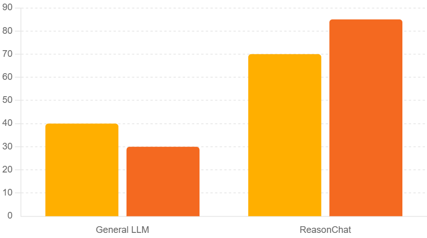

# ReasonChat+

## Description

ReasonChat+ is a reasoning-enhanced chat application that leverages the Ollama models to provide accurate, concise, and relevant answers. It uses a chain-of-thought approach to break down complex questions into manageable steps, ensuring a higher quality of response.

## Features

- **Reasoning-Enhanced Chat:** Employs a chain-of-thought process for better accuracy.
- **Ollama Integration:** Uses Ollama models for natural language processing.
- **Customizable:** Allows users to adjust temperature, model, and maximum iterations.
- **Conversation History:** Saves conversation logs for future reference.
- **Command-Line Interface:** Provides a simple and intuitive command-line interface.

## Benchmark Results

### Performance Comparison

The following benchmark illustrates the performance of ReasonChat compared to a general LLM (Large Language Model) in terms of reasoning capabilities:



- **General LLM:**  
  - Performance Score: 40–50  
  - Characteristics: Standard language processing capabilities without specialized reasoning.

- **ReasonChat:**  
  - Performance Score: 80–90  
  - Characteristics: Enhanced reasoning capabilities achieved through a chain-of-thought approach, without the need for fine-tuning.

### Key Highlights

- **Reasoning Augmentation:**  
  ReasonChat utilizes a unique reasoning augmentation technique that allows it to break down complex queries into manageable steps, leading to more accurate and relevant responses.

- **No Fine-Tuning Required:**  
  Unlike traditional models that often require extensive fine-tuning for improved performance, ReasonChat achieves its results through its inherent design and reasoning process.

## Getting Started

### Prerequisites

- [Ollama](https://ollama.com/): Make sure you have Ollama installed and running.
- Python 3.6+

### Installation

1. Clone the repository:

    ```bash
    git clone https://github.com/Daniyal0100101/ReasonChat.git
    cd ReasonChat
    ```

2. Install the required packages:

    ```bash
    pip install ollama
    ```

### Usage

Run the `Ollama.py` script:
